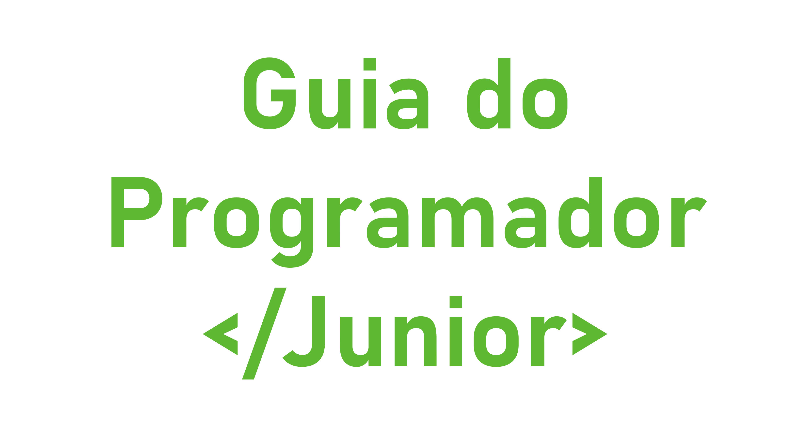

  
  <h3 align="center">Guia Programador Júnior</h3>
  

    <a href="https://github.com/jjeanjacques10/guia-programador-junior/issues">Faça uma sugestão</a>
    ·
    <a href="https://www.instagram.com/jjean_dev/">Entre em contato</a>
  

Este guia tem como objetivo auxiliar aqueles que querem iniciar no mundo de desenvolvimento de software, e quem sabe dar algumas dicas para aqueles que já são da área. Este projeto é colaborativo, fique a vontade para fazer Pull Requests ou abrir Issues (não se assuste, vou explicar esses termos mais a frente 😅😁). Precisamos ajudar uns aos outros e a melhor forma de fazer isso é compartilhando conhecimento!

## Pré-Requisitos

- Querer resolver problemas! 🚀

## Sumário

- Carreira
    - [LinkedIn](./Carreira/LINKEDIN.md)
    - [Caminhos](./Carreira/CARREIRA.md)
- Por onde começar
    - [Backend](./PorOndeComecar/BACKEND.md)
    - [Frontend](./PorOndeComecar/FRONTEND.md)
- Cursos
    - [Gratuitos](./Cursos/GRATUITOS.md)
    - [Pagos](./Cursos/PAGOS.md)
- Recomendações
    - [Canais do Youtube](./Recomendacoes/YOUTUBE.md)
    - [Onde ler artigos](./Recomendacoes/ARTIGOS.md)
    - [Comunidades](./Recomendacoes/COMUNIDADES.md)
    - [Podcasts](./Recomendacoes/PODCASTS.md)
    - [Livros](./Recomendacoes/LIVROS.md)
- Como usar o GitHub [Em breve...]
- Tirar Dúvidas
    - [Fazer perguntas](https://github.com/jjeanjacques10/guia-programador-junior/issues)

---

## Contribuidores ✨

Obrigado a essas pessoas maravilhosas:

<!-- ALL-CONTRIBUTORS-LIST:START - Do not remove or modify this section -->
<!-- prettier-ignore-start -->
<!-- markdownlint-disable -->
<table>
  <tr>
    <td align="center"><a href="https://jakebolam.com"> <b>Jake Bolam</b></a> <a href="https://github.com/jjeanjacques10/guia-programador-junior/commits?author=jakebolam" title="Code">💻</a></td>
    <td align="center"><a href="https://jakebolam.com"> <b>Jake Bolam</b></a> <a href="https://github.com/jjeanjacques10/guia-programador-junior/commits?author=jakebolam" title="Code">💻</a></td>
  </tr>
</table>

<!-- markdownlint-restore -->
<!-- prettier-ignore-end -->

<!-- ALL-CONTRIBUTORS-LIST:END -->
